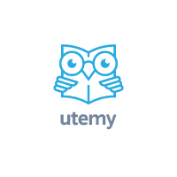

<!-- Improved compatibility of back to top link: See: https://github.com/othneildrew/Best-README-Template/pull/73 -->

<a id="readme-top"></a>

<!-- PROJECT LOGO -->
<br />
<div align="center">
  <a href="https://github.com/NhanNguyen11002/utemy">
    
  </a>

  <h3 align="center">Utemy</h3>

  <p align="center">
    E-learning website
    <br />
  </p>
</div>

<!-- TABLE OF CONTENTS -->
<details>
  <summary>Table of Contents</summary>
  <ol>
    <li>
      <a href="#about-the-project">About The Project</a>
      <ul>
        <li><a href="#built-with">Built With</a></li>
      </ul>
    </li>
    <li>
      <a href="#getting-started">Getting Started</a>
      <ul>
        <li><a href="#prerequisites">Prerequisites</a></li>
        <li>
        <a href="#installation">Installation</a>
        <ul>
        <li><a href="#frontend-setup">Frontend setup</a></li>
        <li><a href="#backend-setup">Backend setup</a></li>
        </ul>
        </li>
      </ul>
    </li>
    <li><a href="#feature-of-the-project">Feature of the project</a></li>
    <li><a href="#contact">Contact</a></li>
  </ol>
</details>

<!-- ABOUT THE PROJECT -->

## About The Project

This project was created by Nhan and Phuoc as a capstone project for their graduation thesis. The purpose of the project is to develop an online learning platform that offers a range of features to enhance the educational experience. The platform includes video conversion, progress tracking, automated quiz scoring, chatbot integration, comment filtering, and customizable event creation, providing a comprehensive and interactive learning environment for students.

<p align="right">(<a href="#readme-top">back to top</a>)</p>

### Built With

- [![React][React.js]][React-url]
- [![Node.js][Node.js]][Nodejs-url]
- [![Typescript][Typescript.io]][Typescript-url]
- [![Express.js][Express.js.dev]][Express.js-url]
- [![Redux][Redux.com]][Redux-url]
- [![Tailwindcss][Tailwindcss.com]][Tailwindcss-url]
- [![Mysql][Mysql.com]][Mysql-url]
- [![Prisma][Prisma.com]][Prisma-url]

<p align="right">(<a href="#readme-top">back to top</a>)</p>

<!-- GETTING STARTED -->

## Getting Started

In this section I will guide you through the steps to install and run the application

### Prerequisites

- You will need to install Nodejs, MySQL, npm in order to run the application\
  For details go to the documentation page list at the [Built with](#built-with) section above

### Installation

#### Backend Setup

Step 1: Install FFMPEG: Install FFMPEG for video processing functionality [here](https://www.ffmpeg.org/).

Step 2: Register for Vnpay Merchant Account:
Register for a merchant account on the Vnpay demo site to obtain your merchant code and hash secret [here](https://sandbox.vnpayment.vn/devreg/).

Step 3: Set Up Email Server with Gmail
Register an email account to use as your mail server with Gmail. Follow the instructions [here](https://support.google.com/mail/answer/185833?hl=en).

Step 4: Register with Certifier
Register an account with Certifier to obtain your ID. Then, create a group and certificate template [here](certifier.io).

Step 5: Register with Microsoft Azure
Register for a Microsoft Azure account to obtain your AI key and endpoint for the chatbot.

Step 6: Create .env File:
Add a `.env` file in the backend directory with the following content:

```
PORT = 3001
DATABASE_URL= 'mysql://username
@localhost:3306/utemy' # replace 'username' and 'password' with your MySQL database credentials
DOMAIN_NAME = "http://localhost:3000" # frontend URL
BACKEND_DOMAIN_NAME = "http://localhost:3001" # adjust port and domain as needed
TOKEN_ACCESS_EXPIRED_TIME = "15m" # adjust as needed
TOKEN_REFRESH_EXPIRED_TIME = "10d" # adjust as needed
PUBLIC_URL = "http://localhost:3001" # adjust port and domain as needed
PUBLIC_API_URL = "http://localhost:3001/api" # adjust port and domain as needed
JWT_SECRET_KEY = "Utemy" # adjust as needed
HASH_SALT = "10" # adjust as needed
EMAIL_SERVER = # information from Step 3
PASSWORD_SERVER = # information from Step 3
PAGE_SIZE = "10" # adjust as needed
TZ = "Asia/Ho_Chi_Minh" # information from Step 2
VNP_TMN_CODE = # information from Step 2
VNP_HASH_SECRET = # information from Step 2
VNP_URL = "https://sandbox.vnpayment.vn/paymentv2/vpcpay.html"
VNP_API = "https://sandbox.vnpayment.vn/merchant_webapi/api/transaction"
VNP_RETURN_URL = "http://localhost:3000/checkout/vnpay_return" # adjust port and domain as needed for the frontend
CERTIFIER_ID = # information from Step 4
OPENAI_API_KEY = # information from Step 5
OPENAI_ENDPOINT = # information from Step 5
```

Step 7: Install Dependencies:
Run the command `npm i`

Step 8: Initialize the Database
Run the command: `npx prisma db push` if the database is not already created.

Step 9: Seed the Database
Run the command: `npx prisma db seed`
to create the first admin account (utemyvietnam@gmail.com/2011069020110701)

Step 10: Start the Backend Server:
Run the command `npm run dev`

#### Frontend Setup

Step 1: Create .env File:
Create a `.env` file in the frontend directory with the following content:

```
REACT_APP_API_URL = "http://localhost:3001" # backend domain and port
REACT_APP_ENV = "production"
REACT_APP_SECRET_HASH= # VNP_HASH_SECRET from the backend .env file
GENERATE_SOURCEMAP=false
```

Step 2: Install Dependencies
Run the command: `npm i`

Step 3: Start the Frontend Server
Run the command: `npm start`

<p align="right">(<a href="#readme-top">back to top</a>)</p>

## Feature of the project

### Video Conversion

- **Multi-resolution Video Conversion**: Automatically convert uploaded videos into multiple resolutions to ensure compatibility with different devices and internet speeds.

### Learning Progress Tracking

- **Track Student Progress**: Monitor and record the learning activities and progress of each student, providing insights into their engagement and performance.

### Automated Quiz Scoring

- **Auto-Scoring Quizzes**: Implement quizzes that are automatically scored, with the option to set time limits or allow unlimited time for completion.
- **Multiple quiz type**: multiple choices, true/false, fill in the blanks

### Chatbot Integration

- **AI-Powered Chatbot**: Utilize an AI chatbot to assist students with queries, provide support, and enhance the learning experience.

### Comment Filtering

- **Comment Moderation**: Filter and moderate comments to maintain a constructive and respectful learning environment.

### Event Creation

- **Customizable Events**: Create events with customizable reward ratios, allowing for tailored incentives and engagement strategies.

### And many other features...

<p align="right">(<a href="#readme-top">back to top</a>)</p>

<!-- CONTACT -->

## Contact

Nguyễn Trương Nhân - ntnhan11002@gmail.com\
Bùi Văn Hữu Phước - buip930@gmail.com

Project Link: [Utemy](https://github.com/NhanNguyen11002/utemy)

<p align="right">(<a href="#readme-top">back to top</a>)</p>

<!-- MARKDOWN LINKS & IMAGES -->
<!-- https://www.markdownguide.org/basic-syntax/#reference-style-links -->

[React.js]: https://img.shields.io/badge/React-20232A?style=for-the-badge&logo=react&logoColor=61DAFB
[React-url]: https://reactjs.org/
[Node.js]: https://img.shields.io/badge/Node.js-43853D?style=for-the-badge&logo=node.js&logoColor=white
[Nodejs-url]: https://nodejs.org/en
[Typescript.io]: https://img.shields.io/badge/TypeScript-007ACC?style=for-the-badge&logo=typescript&logoColor=white
[Typescript-url]: https://www.typescriptlang.org/
[Express.js.dev]: https://img.shields.io/badge/Express.js-4A4A55?style=for-the-badge&logo=Express.js&logoColor=FF3E00
[Express.js-url]: https://expressjs.com/
[Redux.com]: https://img.shields.io/badge/Redux-593D88?style=for-the-badge&logo=redux&logoColor=white
[Redux-url]: https://redux-toolkit.js.org/
[Tailwindcss.com]: https://img.shields.io/badge/Tailwind_CSS-38B2AC?style=for-the-badge&logo=tailwind-css&logoColor=white
[Tailwindcss-url]: https://tailwindcss.com/
[Mysql.com]: https://img.shields.io/badge/MySQL-005C84?style=for-the-badge&logo=mysql&logoColor=white
[Mysql-url]: https://www.mysql.com/
[Prisma.com]: https://img.shields.io/badge/Prisma-3982CE?style=for-the-badge&logo=Prisma&logoColor=white
[Prisma-url]: https://www.prisma.io/
